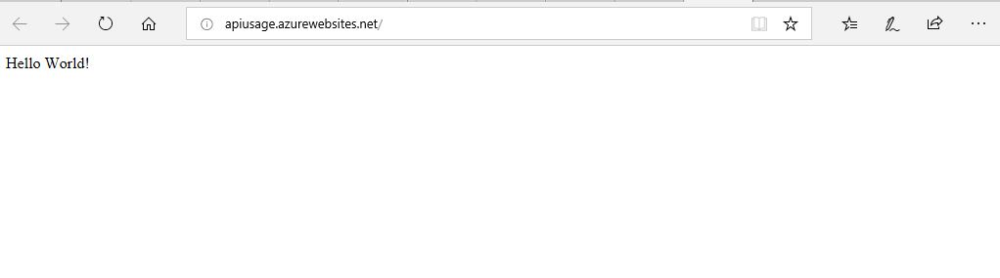

#Link to site 
http://apiusage.azurewebsites.net/

1. Name 
#Lab 18 Student Enrollment

2. One-Liner
This is a blank web application that consumes an API.

3. Usage
a. First install appropriate programs. Refer to Step 5 in this README.
b. Upon start up, the user will be shown a "Hello World"
c. It is supposed to consume an API created in Lab17.

Visual

4. API
API from Lab17 was used for this lab.

5. Installation
Install Visual Studio 2017 and .NET Core SDK. Have Microsoft Azure account. Have NewtonSoft downloaded. And Json2Csharp package installed as well.

6. License
This program's License is MIT.

7. Acknowledgements - I worked with 
- http://github.com/jcqnly 
- Jesse Atay, my life partner
- Mario Nishio.